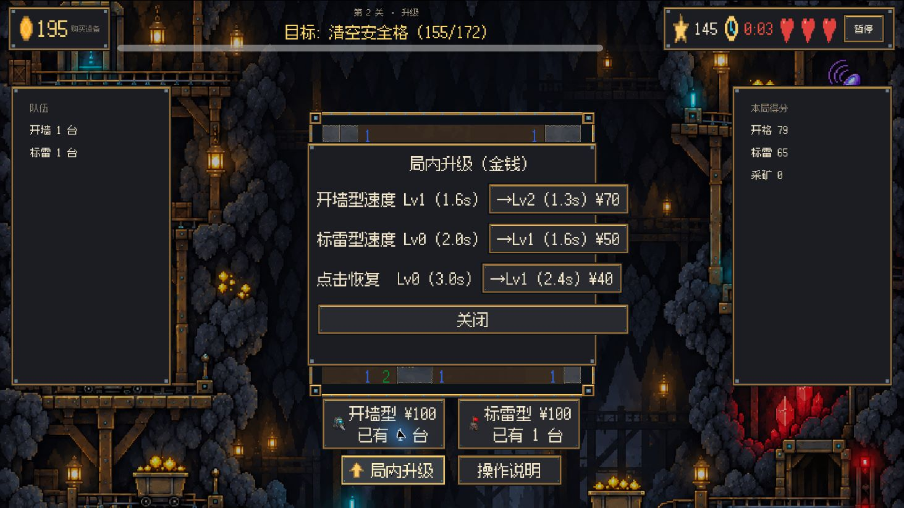
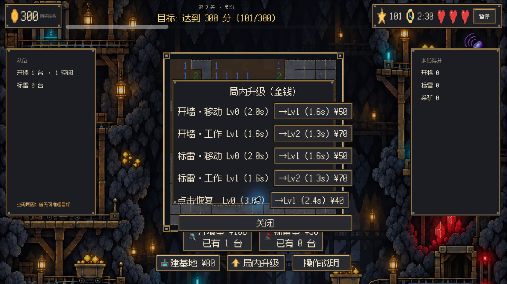
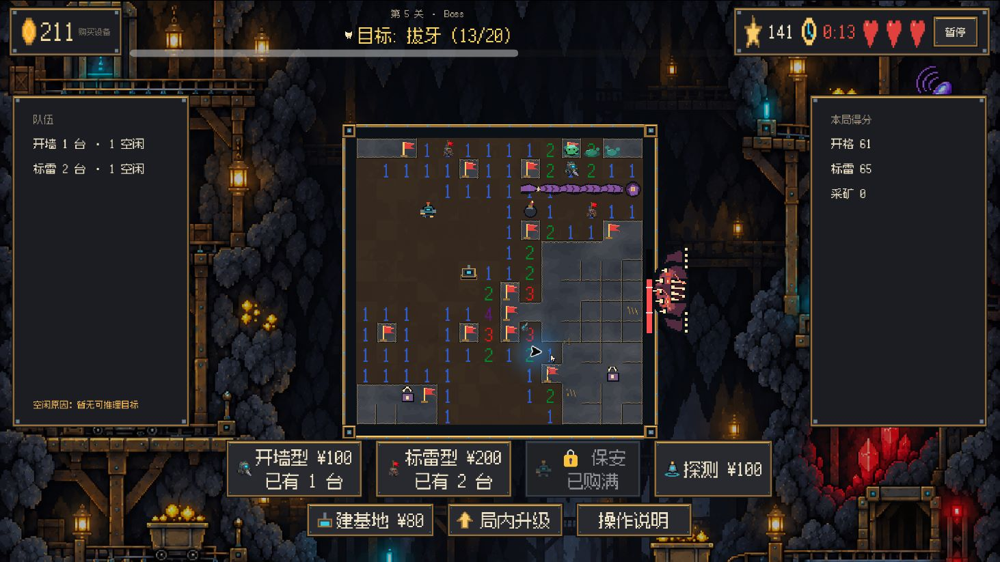

# 扫雷挖矿测试版 · UI 与素材试玩反馈（2026-10-01）

配套待办：[优先处理清单](试玩反馈-优先处理清单-2026-10-01.md)。本报告保留观察与证据；任务状态和验收标准以配套清单为准。

整体矿洞视觉已经成立，背景、铜色边框、青色机器灯和警示色有一致性。当前影响完成度最大的部分是界面布局、状态解释和跨页面收尾。应先修这些问题，再补少量帮助辨认操作的素材。

本次用电脑控制实际操作当前 worktree，基线为 `b615b6b`，Godot 4.6.1。第一关实际通关；第二、三、四关游玩至超时；第五关推进到第三阶段、拔牙 13/20 后超时。操作覆盖购买及放置机器人、标雷、局内/局外升级、建基地、保安、探测、点击虫巢、灭火、暂停、规则、设置及窗口/全屏切换。未完成五关全部通关，未验收第五关胜利演出和试玩完成页。

窗口设置测试了 1024×768、1280×960 和全屏。电脑控制截图使用逻辑坐标，不能直接把截图尺寸当成玩家屏幕的物理尺寸。布局溢出的截图另用 PIL/numpy 检查边线，并与场景布局核对。没有对音质、音乐听感或混音作主观评价。

**试玩中确定的问题**

优先级含义：P1 = 发给陌生试玩者之前应修；P2 = 接下来提升清楚程度和完成度；P3 = 美术润色。

| 优先级 | 位置及触发方式 | 实际表现与影响 | 建议 |
| --- | --- | --- | --- |
| P1 | 第一关通关 → 结算“下一关” | 又打开“第1关·教学”的关前卡。回菜单则正确显示“继续试玩·第2关”。连续游玩被打断。 | 修正下一关编号提取；以实际目标关 ID 验证跳转。代码定位：`main.gd::_on_next_level()` 的 `substr(-1)`。证据 09、10。 |
| P1 | 设置页，两个窗口分辨率 | 面板底部被裁切，“返回”贴在底边，底部说明无法完整显示。放大窗口仍存在。 | 内容随容器自适应，必要时滚动；返回按钮保留安全边距。证据 02、03。 |
| P1 | 第二关打开“局内升级”；第三关增加升级条目 | 第二关购买按钮和关闭按钮超出面板右边。第三关最后一行与关闭按钮又超出面板底边。 | 用容器约束面板最小尺寸和条目；避免固定面板尺寸搭配动态长文本。全屏仍溢出。证据 14、17、20。 |
| P1 | 升级面板保持打开直到第二关超时 → 选第三关 → 开始 | 上一局的升级面板仍出现在关前卡后，并在新关开局继续盖住棋盘。 | 结算、离开关卡、开始新关时统一收起局内浮层。`_start_level_with()` 当前没有收起 UpgradePanel。证据 20。 |
| P1 | 第三、四关局内，全屏 | 棋盘底框与商店顶端发生重叠。第三关教学聚光框也穿过卡片标题。 | 根据商店实际高度分配棋盘区域，并预留棋盘框及教学高亮的边距。证据 21、26。 |
| P1 | 第一关购买开墙机器人后 | 商店文字改变后卡片宽度重新分配，矿工卡及锁定说明被挤出窗口右侧。 | 约束每张卡的宽度，将价格、数量、禁买原因分行或折行，测试“已购满”“差¥…”等状态。证据 08。 |
| P2 | 第三关分数面板、结算 | 这一局开格37、标旗75、采矿0，最终213；缺少101分的预开格分。开局已101分时右侧账单却全是0。 | 给预开格分独立行或明确纳入开格分，让账单可相加。源码确认 `preopen_scores` 直接加总分。证据 23。 |
| P2 | 第五关结算 | 开格61、标旗65、采矿0，最终141。额外15分来自史莱姆击杀10和灭火5，但账单没有对应得分行。 | 补战斗/清障得分明细，保持局内与结算口径一致。证据 31。 |
| P2 | 第四、五关购买保安后 | 商店显示保安“已购满”，队伍面板却没有保安。左栏空白很大，仍不能看见新单位的状态。 | 增加保安数量、工作状态；让队伍栏只保留本关相关信息。`team_panel.gd` 的 NAMES/行节点未包含 guard。证据 25、26。 |
| P2 | 建基地、使用探测、尝试非法落点 | 底部统一写“点击地图放置机器人”；建基地和探测也沿用它。非法落点只有红角框，没有原因；探测前未看到3×3范围预览。 | 显示当前选中的对象、费用和落点规则；探测显示完整范围，非法落点给短原因。证据 22、25。 |
| P2 | 第四关结算“你的操作” | 我实际点了虫巢两次、使用探测并进行了购买放置，界面却显示“你的操作0次”。这是扫雷操作统计，标题显得像所有操作。 | 改成“你的扫雷操作”，或者另列战斗/设备操作；不必改变现有统计目标。证据 27。 |
| P2 | 超时结算 | 第二至四关统一显示“本次挖矿结束·目标未达成”；第五关显示撤退文案。结束原因需要从0:00和用时推断。 | 加一行“时间到”或“生命耗尽”，与收益、目标达成状态分别说明。证据 18、31。 |
| P2 | 第一关商店 | 保留大面积“检测型未解锁（通2-5）”“矿工未解锁（通3-5）”，五关试玩无法到达这些关。 | 从试玩页收起，或明确写“正式版内容”；空出来的空间给当前两种机器人。证据 05、08。 |
| 暂缓 | 主菜单反馈入口 | 本次菜单没有反馈按钮。场景中按钮固定隐藏，脚本也未接反馈信号；设置 feedback_url 默认空。 | 体验建议是提供提交说明或反馈入口。但 `todo.md` 已记录 2026-10-01 用户决定暂缓渠道、按钮保持隐藏；本轮不将此建议列为待实现任务。 |

另有一条首玩路径缺口：从主菜单直接开始，进入关前卡再按 ESC，会显示尚未初始化的选关页。本次看到左侧无关卡、右侧只有“01/尚无记录”；回菜单再点“选择关卡”恢复正常。源码 `_handle_escape()` 直接 `level_select.show()`，没有先设置章节和刷新。证据 11、12。建议一并修好返回路径。

**界面观感与阅读体验**

主菜单是目前最完整的一页。背景有矿灯、矿车和机器人细节，中心菜单位置清楚，标题和主按钮容易找到；这套方向值得保留。暂停页的目标、余额、时间和操作入口也比较完整。商店直接写出还差多少钱，队伍列出闲置原因，这两项比只把按钮变灰更有帮助。

局内画面有明显的空间分配失衡。第一关棋盘很小，两侧却仍然是大面板，只用到面板顶部几行；玩家的注意力容易被大块空白和重复金边分散。全屏后字和格子更易读，但两侧空白仍然很大。建议把队伍与得分做成紧凑信息卡，把棋盘放到主要视觉区域，并按关卡大小调整占比。

文字存在层级倒置。选关左栏简介很大，右边真正决定是否开局的目标、新增内容、成绩则很小；右侧详情面板大部分是空的。规则正文、升级说明和版本号颜色偏灰，在窗口模式尤其费力。建议扩大重要正文、减少次要段落，把规则改成小图例加短句。此处是实际阅读感受，没有声称测得某个对比度比值。

机器人与基地虽然已有贴图，但棋盘上体积小，机器人还会经过数字格；工作、移动、空闲需要依赖侧栏文字才能分清。机器人的类型识别应靠稳定的轮廓、工具或角色标记，而不只靠几颗灯的颜色。当前 robot.gd 的贴图主要为 idle/move 两张，working 使用静态帧；补工作表现会比再换一套背景更直接地帮助玩家理解画面。

Boss 三个阶段已经有姿态、移动、火焰和触手表现，实际进入第三阶段时也未看到缺图占位。但巨兽身上的条从空往满增长，外观容易被理解成血条；可以标成“拔牙进度”，或更明确地用牙齿逐颗消失来表达。触手根部、可点史莱姆和已确认雷也适合配图例。它们已存在贴图，缺的是交互含义的说明。

**还值得补哪些素材**

| 顺序 | 建议补充 | 解决的问题 | 现有资源能否复用 |
| --- | --- | --- | --- |
| 1 | 小型规则图例：数字/旗帜/确认雷/蛛网/锁格/黏液/火焰/触手根部，配鼠标动作 | 新符号的含义与可点击对象不明确 | 大部分图标已存在，优先把现有贴图放进说明页或悬停提示；无需重新画一整套。 |
| 2 | 操作模式的对象预览、探测3×3范围、非法落点原因标记 | 购买后不清楚当前要放什么、影响哪里、为何放不了 | 已有 cursor_placing、tile_place_valid/invalid；扩展显示规则即可，范围也可程序绘制。 |
| 3 | 开墙/标雷/保安的工作动作或明显工作状态符号 | 看见机器在动，却难以确认谁在开格、标雷、除虫 | 保留现有角色立绘，增加工作帧或短特效；不必重做 idle/move。 |
| 4 | 局内/局外升级的小图标：移动、工作、点击恢复、起始金币、生命、开局机器人 | 升级页纯文字、长文本容易撑宽，能力难快速区分 | 金币、心形和机器人图标可复用；移动/工作需明确且不同的符号。 |
| 5 | 不同结算状态的徽记、五关的小型主题缩略图 | 通关与超时沿用同一徽记，选关详情缺乏视觉信息 | 属于润色项，排在布局和说明之后。 |

当前已经存在并接入的重点素材包括：矿洞背景、机器人、基地、旗帜、开格/插旗相关特效、三类敌虫及史莱姆、虫巢及破损状态、蛛网、锁格、黏液、确认雷、Boss姿态、炸弹、火焰、触手、牙齿和链条。试玩过程中未看到这些素材的加载缺失。因此现在不建议优先重做矿洞背景、地砖或整套机器人立绘。

**建议处理顺序与证据说明**

先收好设置页、升级面板、棋盘/商店边界和跨关浮层；随后修下一关、ESC返回选关、结算账单和队伍保安条目；再完善阅读、操作模式、图例和工作动作。这样更容易把已有美术的完成度呈现出来。

调研参考为微软的游戏文字与对比度指南，其中包含《帝国时代II》《辐射：新维加斯》等游戏界面的示例。采用的是“重要文字应易读、HUD背景不要干扰读取、允许调整显示”的原则，未把主机标准直接当作这个PC试玩版的硬性验收指标。[文字显示指南](https://learn.microsoft.com/en-us/gaming/accessibility/xbox-accessibility-guidelines/101)、[对比度与游戏案例](https://learn.microsoft.com/en-us/gaming/accessibility/xbox-accessibility-guidelines/102)。

31张原始截图、运行日志、本次试玩存档及边线测量脚本保存在[试玩证据目录](试玩证据-2026-10-01/)。目录带有 `.gdignore`，避免 Godot 将文档截图导入为游戏资源。像素检查先输出独立金色边线峰值，再结合已观察到的面板与按钮位置确认对象；没有预设网格等距。17号截图面板右边线x=964，购买/关闭按钮右边线x=1015；21号截图商店顶边y=646–647，棋盘高亮底边y=661–663。这里全部是对应截图的像素坐标，用于确认交叉位置，不是玩家显示器的物理像素。详见[测量输出](试玩证据-2026-10-01/pixel-measurements.jsonl)。

这次正常游戏运行日志未记录 ERROR/WARNING；初次worktree编辑器导入阶段出现了导入缓存尚不存在的资源错误，导入后游戏启动正常，不能把该阶段错误等同于发行包缺图。未测试发行版导出包。

原存档和设置已恢复并与备份逐文件SHA256核对一致。编辑器重排的project.godot和导入文件也已恢复；游戏代码未改动。本次新增内容为反馈报告和试玩证据。
